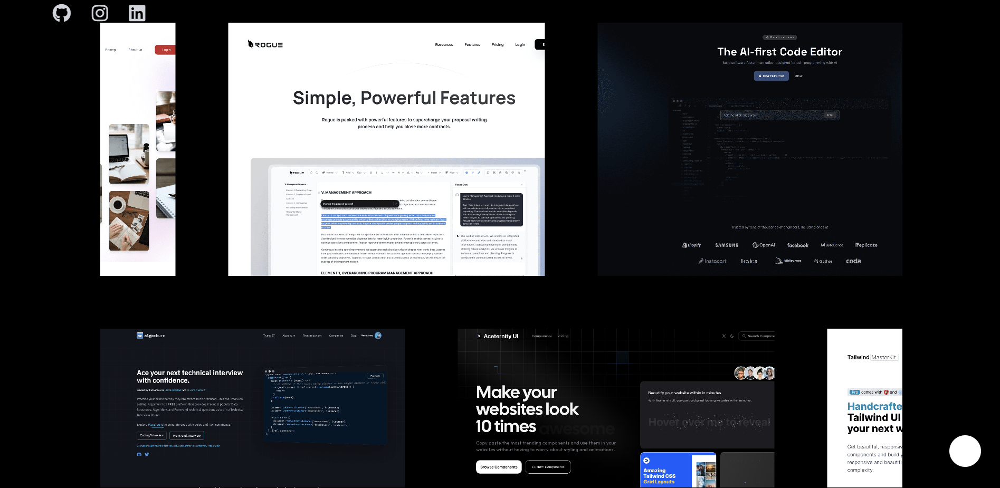
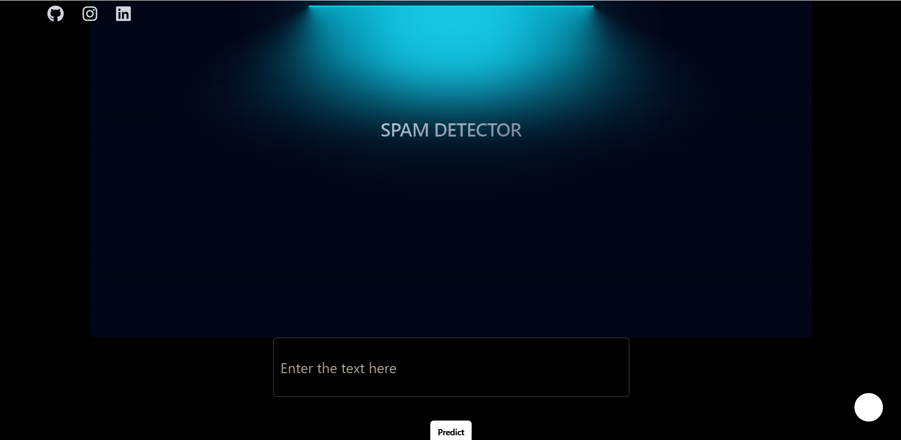
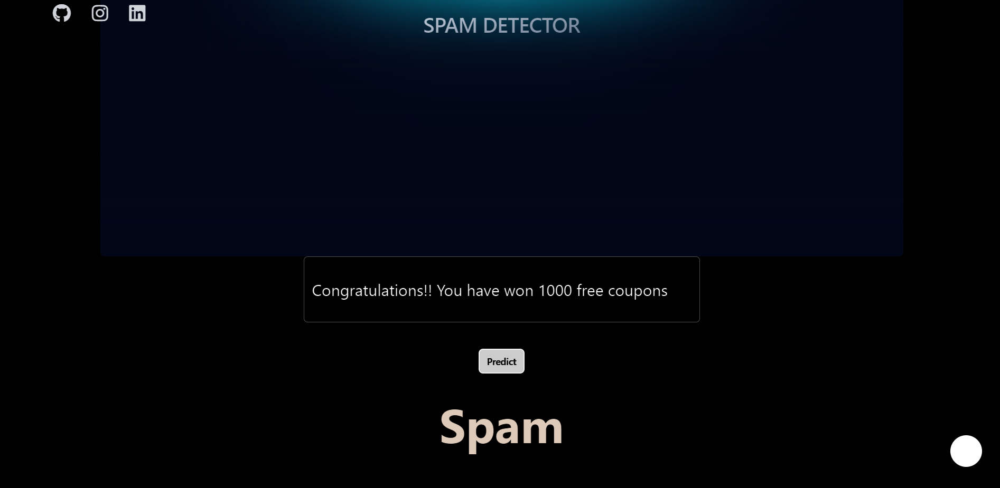

<h1 align="center">SpamDetective</h1>
<h5 align="center">"Keep Your Inbox Clean and Secure with Our Smart Spam Detection!"</h5>

# Project Overview

Our SpamDetective website leverages advanced prediction models to accurately determine whether an email or SMS is spam or ham. By employing cutting-edge machine learning algorithms and natural language processing techniques, Spamdetective analyzes message content in real-time, ensuring users receive only legitimate communications. The website offers a user-friendly interface for easy interaction and immediate results, enhancing email and SMS security and efficiency. With SpamDetective, users can trust that their inboxes remain clutter-free and protected from unwanted spam, optimizing their digital communication experience.

# Web Application

This javascript based application allows users to enter the SMS received on mobile phones or Emails in our day-to-day life. It then predicts that whether the message entered by the user is a Spam or Ham using various machine learning prediction models including Multinomial naive bayes algorithm along with Logical Regression, ExtraTreesClassifier, SVC, Adaboost, XGBoost,etc.

The Frontend of the website is made using ReactJs(Vite), TailwindCSS and TypeScript, whereas the prediciton model is made using Python and integrated with the frontend using Flask.

## Project Contributors

- [@Abhrajit Das](https://github.com/Abhrajitdas02)
 

## Documentation
Frontend-

[ReactJs](https://react.dev/blog/2023/03/16/introducing-react-dev)
[TailwindCss](https://v2.tailwindcss.com/docs)
[TypeScript](https://www.typescriptlang.org/docs/)

Backend-

[Python](https://docs.python.org/3/)
[Flask](https://flask.palletsprojects.com/en/3.0.x/)

## BUILD PROCESS

- <b>Clone Or Download the Repository</b>
  - `git clone https://github.com/Abhrajitdas02/SpamDetective.git`
- <b>FOR FRONTEND:</b>
 
  - `cd frontend`
  - `npm i` to install dependencies
  - `npm run dev`
- <b>FOR BACKEND:</b>
  - `cd Backend`
  - - `pip install -r requirments.txt`
  - `python app.py` to start the node dependencies

## TECHNOLOGY STACK

FRONTEND

BACKEND

## Features

- Dynamic and interative interface 
- Fast, efficient and accurate prediction model.
- Provides the examples of Spam and Ham Messages.
- A text input field to type the Emails/SMS for tesing.

## Website Preview 

